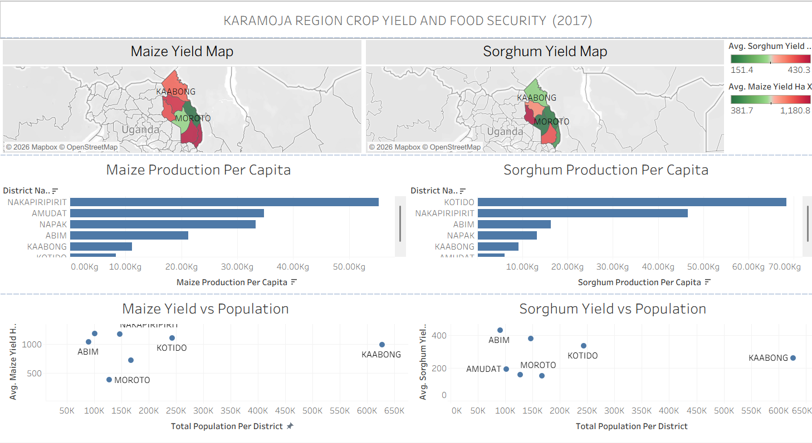

# 🌾 Karamoja Crop Yield & Food Security Analysis (2017)

## 📌 Project Overview

This project analyzes crop yield and food security patterns in the Karamoja region of Uganda using district-level agricultural and population data.

The goal was to understand where food insecurity risks are highest by examining crop productivity, population pressure, and per capita production.

This project combines data cleaning in Python, geographic mapping, and dashboard design in Tableau to support practical, data-driven decision-making.

---

## 🎯 Problem Statement

Karamoja is one of Uganda’s most food-insecure regions. From the data and background research, some key contributing factors include:

- Low agricultural productivity  
- Recurring drought conditions  
- Uneven distribution of crop yields  
- Heavy reliance on maize and sorghum  

Because resources are limited, decision-makers need clear insights to know where to prioritize support.

---

## 🎯 Objectives

- Analyze maize and sorghum yields by district  
- Evaluate production per capita (food availability per person)  
- Assess the relationship between population and productivity  
- Develop an interactive dashboard for stakeholders
## 🧠 What I Did

### 1️⃣ Data Cleaning
I cleaned and merged crop yield data with population data using Pandas.  
This involved checking for missing values and ensuring district names matched correctly.

### 2️⃣ Creating New Metrics
To better understand food availability, I calculated **production per capita**.  
This helped show how much food is available per person in each district.

### 3️⃣ Visualization & Analysis
I created:

- District-level yield maps  
- Bar charts comparing maize and sorghum yields  
- Production per capita comparisons  
- A yield vs population analysis  

These visuals helped reveal patterns that were not obvious from raw numbers alone.

### 4️⃣ Dashboard Development
Finally, I built an interactive Tableau dashboard so stakeholders can explore the data dynamically.

---

## 🛠 Tools & Technologies Used

- **Python** (Pandas, Matplotlib)
- **Jupyter Notebook**
- **Tableau Public**
- Geographic Shapefiles (District boundaries)

  ## 📊 Key Visualizations

> Screenshots below are from my analysis and dashboard.

### 📘 Sorghum Yield by District


### 🌽 Maize Yield by District


### 📊 Production Per Capita


### 📈 Yield vs Population


---

## 📊 Key Analysis Components

- Sorghum Yield Map  
- Maize Yield Map  
- Sorghum Production Per Capita  
- Maize Production Per Capita  
- Yield vs Population Analysis  
- Interactive Tableau Dashboard  

---

## 📈 Key Insights

From the analysis, I observed that:

- Crop productivity differs significantly across districts.
- Some districts with high population levels have relatively low food production per person.
- Population size alone does not guarantee higher productivity.
- Dependence on only two major crops increases vulnerability to climate shocks.  

---

## 📌 Recommendations

- Based on the findings:

- Low-yield districts should be prioritized for agricultural support.
- Districts with high population but low per capita production may need urgent intervention.
- Climate-resilient farming techniques should be promoted.
- Crop diversification could reduce long-term vulnerability. 

---

## 🌍 Interactive Dashboard

You can explore the full interactive dashboard here:

🔗 **Tableau Public Link:**  
https://public.tableau.com/app/profile/kelvin.obungu/viz/Karamoja_Dashboard/KaramojaCropYieldFoodSecurityDashboard2017?publish=yes

---

## 📂 Repository Structure
```
Karamoja_Food_Security_Project/
│
├── Images/
├── SHAPEFILES/
├── TABLES/
├── Kelvin_Obungu.ipynb
├── cleaned_karamoja_data.csv
├── README.md
```

---

## 👤 Author

Kelvin Obungu  
Data Analytics & Visualization Enthusiast
